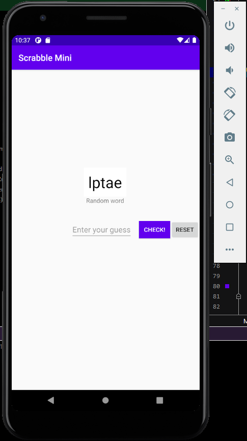
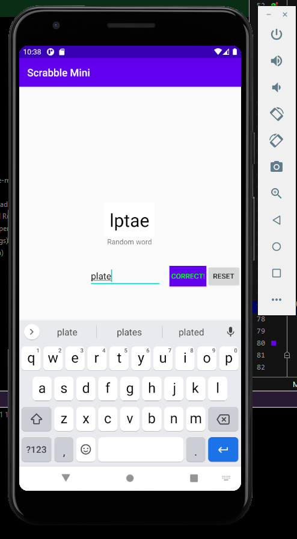
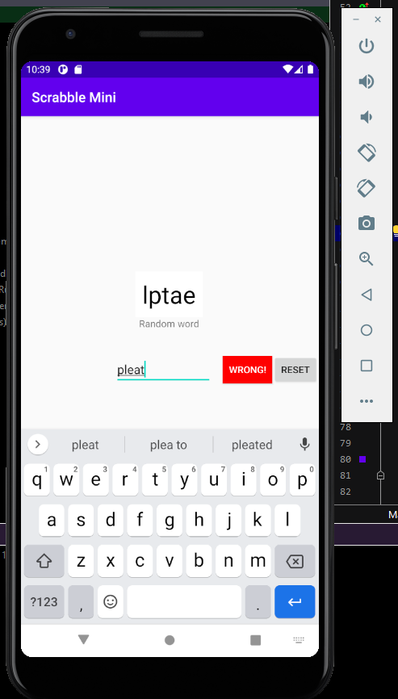

How to use the Scrabble Mini

* Run the app on emulator or android phone
* Enter your guess of the correct word for the random word
* Click Check button and see if your are right or wrong
* Reset to play again with a new word

