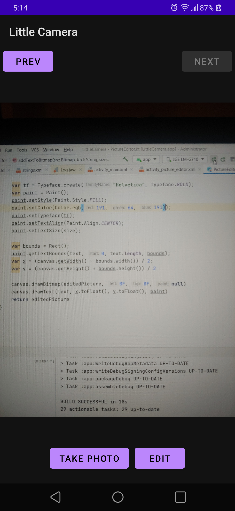
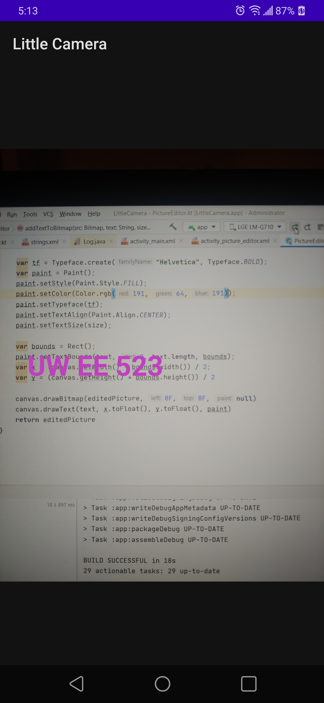

 *Daniel Hunegnaw <dhuneg@uw.edu>*
 
 **Little Camera**: *a small camera app that takes photos via intent with navigation capability of taken photoes and has the ability to edit the photo i.e. adds 'UW EE 523' text to the picture*

Little Camera is the app I wrote for the Homework 2. It has the following features.
- **Take a Picture**: Using the camera intent, the app takes a pictures and saves it to its own data folder. The button **Take a Photo** is used to take pictures
- **Navigation of pictures**: The app loads all the pictures/photoes it took via intent and displays in an `ImageView` with navigation buttons on the top
  -  **Next Button**: Navigates to the next latest picture taken. At the end it gets disabled
  -  **Prev Button**: Navigates backwards. When it reaches at the first pictures, it gets disabled
- **Editing**: The app has an **Edit** button to edit the **Current picture/photo** being previewed. You can use the **Next** or **Prev** button to preview another picture and edit it. The **Edit** functionality opens another activity passing the path of the current photo being previewed. The Editor activity adds the text **UW EE 523** in purple color to the image. However, it does not save it to the file
-Various screenshots are shown below

  
Screenshot showing home screen ( screenshot take from my phone)

  
Screenshot showing edited photo

  
Screenshot showing Prev and Next button enabled -> meaning there are at least three photoes taken by the app

**Designed and implemented by** : Daniel Hunegnaw

