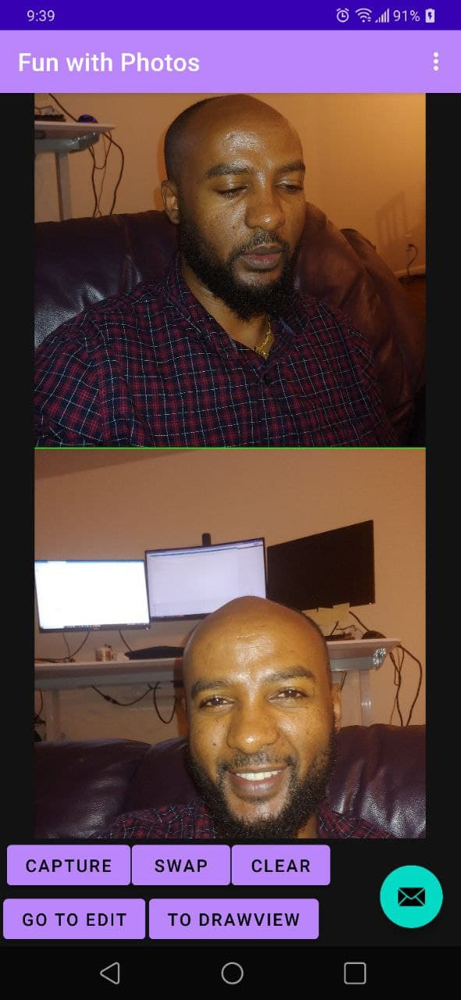
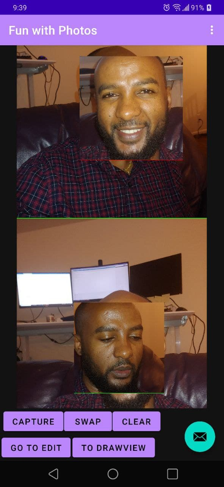
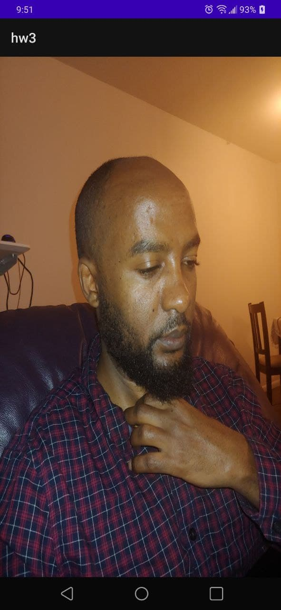

 *Daniel Hunegnaw <dhuneg@uw.edu>*
 
 **HW3**: a small camera app that takes two photos via intent with face contour detection capability, swap the contour of faces detected, and has the ability to navigate to an edit page where you can blur the original photo. In addition, it retains the photoes upon configuration changes such as rotation of the phone, and you can also clear the face-swapped or blurred photo back to the original

HW3 is the app I wrote for the Homework 3. It has the following features.
- **Take a Picture**: Using the camera intent, the app takes a pictures and saves it to its own data folder. The button **Capture** is used to take two pictures. The picture taken are display on top of each other with scrollbar feature
- **Face Detection and swap**: The app used the latest google MLKit (https://developers.google.com/ml-kit/vision/face-detection/android). The link given in the assignment is declared to be outdated( deprecated). So I use the latest one, which does not depend on firebase but identical functionality and interfaces.
  -  **Swap Button**: Takes the two photo taken, detects faces with contour (rectangles around the face) and then swaps the faces ( contours). I used two photoes of mine taken in different angle to show the functionality as shown in the screenshot below
  -  **clear Button**: Resets the photos back to the original after face swap
  - **Go To Edit Button**: Takes you to the Edit page where you can blur first photo taken
  - **To Draw View**: Takes the view where a DrawView is used to display the first photo take. 
- **Editing**: On the Edit page. Duplicates of the first photo are shown stacking vertically. One is used to compare after the other is blurred.
  - **Blur Button** : blurs the photo on the top image view, you can see how it is blurred with the reference original photo shown below the blurred one. For blurring, I found this library to be simple  and effect (https://github.com/wasabeef/Blurry), and therefore, I used it
  - **Clear Button**: Clears the blurred photo back to the original
  - **Go to Main Button** : it takes you back to the main page/view
-Various screenshots are shown below

  
Screenshot showing the original photoes taken before swap

  
Screenshot showing home screen where the two photoes has faces swapped ( the contour of the face is swapped)

  
Screenshot showing the blurred photo

  
Screenshot showing drawview display

**Designed and implemented by** : Daniel Hunegnaw

