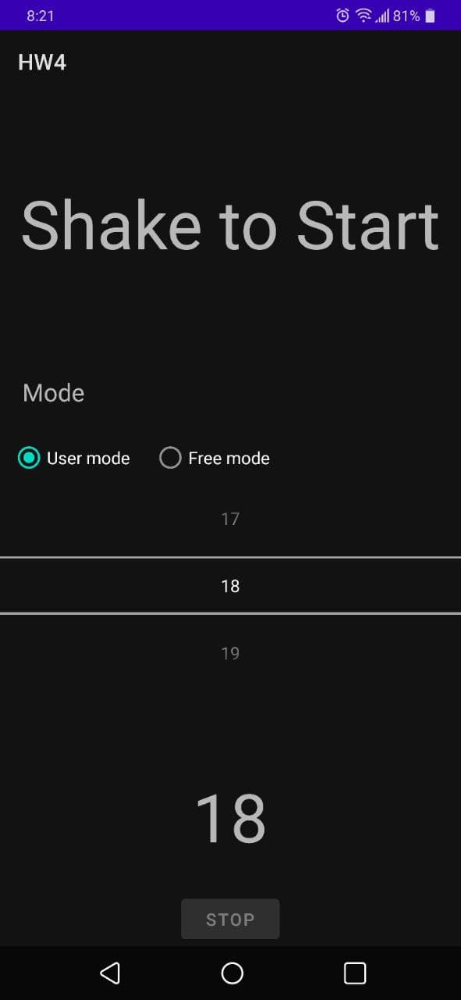
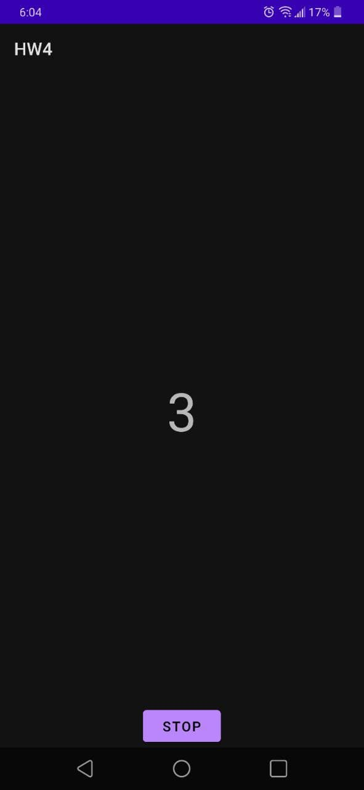
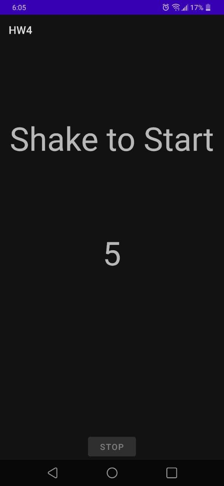

*Daniel Hunegnaw <dhuneg@uw.edu>*
 
 **HW4**: a small step counting app. It uses threshold (acquired through data collection and analysis) to count steps. Similary, a shaking feature is implemented based on threshold which I fixed it after collecting and analyzing the data.

HW4 is the app I wrote for the Homework 4. It has the following features.
- **Shake to Start**: You can shake the app to start the step counter. Once the step counter is enabled, it will be counting steps and the **Stop** button is enabled to stop
- **Stop**: The app has a button to stop the counting of steps.
  
-Various screenshots are shown below

  
App on start

  
App during step counting with **stop** button enabled

  
After the **stop** button is triggered

**Designed and implemented by** : Daniel Hunegnaw

